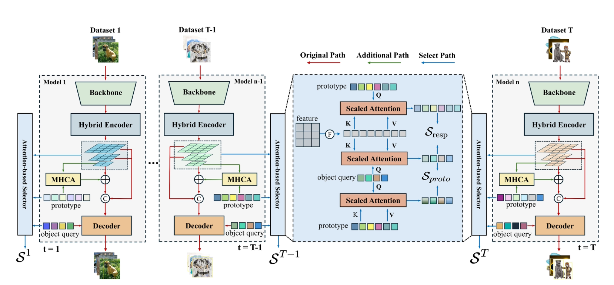

## ProSe: Decoupling Knowledge via Prototype-based Selection for Data-Incremental Object Detection

This repository contains the official implementation of ProSe for data-incremental object detection. The method addresses catastrophic forgetting by maintaining independent branches for each increment and using prototype-based attention selection to route inputs to the most suitable branch.

### Method Overview

ProSe introduces three key components:

1. **Prototype Learning Module**: Learns a set of prototypes per increment to capture semantic distribution during training.
2. **Attention Selector**: Routes inputs to the best branch during inference based on prototype similarity and response consistency.
3. **Branch Manager**: Maintains independent encoder-decoder pairs for each increment.

The method achieves state-of-the-art performance on incremental object detection without requiring knowledge distillation or replay.

### Model Architecture



### Installation

```bash
cd rtdetrv2_pytorch
pip install -r requirements.txt
```

### Training

Single GPU training:
```bash
python tools/train_prose.py -c configs/prose/prose_rtdetrv2_r50vd_6x_coco.yml
```

Multi-GPU training with 4 GPUs:
```bash
CUDA_VISIBLE_DEVICES=0,1,2,3 torchrun --master_port=9909 --nproc_per_node=4 \
    tools/train_prose.py -c configs/prose/prose_rtdetrv2_r50vd_6x_coco.yml --use-amp --seed=0
```

Multi-increment training:
```bash
# Train base increment
python tools/train_prose.py -c configs/prose/prose_rtdetrv2_r50vd_6x_coco.yml --increment-idx=0

# Train new increment
python tools/train_prose.py -c configs/prose/prose_rtdetrv2_r50vd_6x_coco.yml \
    --increment-idx=1 --resume checkpoint_epoch_72.pth
```

### Inference

Single image inference:
```bash
python tools/inference_prose.py \
    -c configs/prose/prose_rtdetrv2_r50vd_6x_coco.yml \
    -r checkpoint_epoch_72.pth \
    -i image.jpg \
    -o results/
```

Batch inference on image directory:
```bash
python tools/inference_prose.py \
    -c configs/prose/prose_rtdetrv2_r50vd_6x_coco.yml \
    -r checkpoint_epoch_72.pth \
    -i images/ \
    -o results/
```

### Configuration

Key hyperparameters in `configs/prose/prose_rtdetrv2_r50vd_6x_coco.yml`:

```yaml
prose:
  use_prose: true
  hidden_dim: 256
  num_prototypes: 1200
  num_heads: 8
  alpha: 1.0
  lambda_weight: 0.5
  use_gumbel_softmax: true
```

### License

This project is licensed under the MIT License.